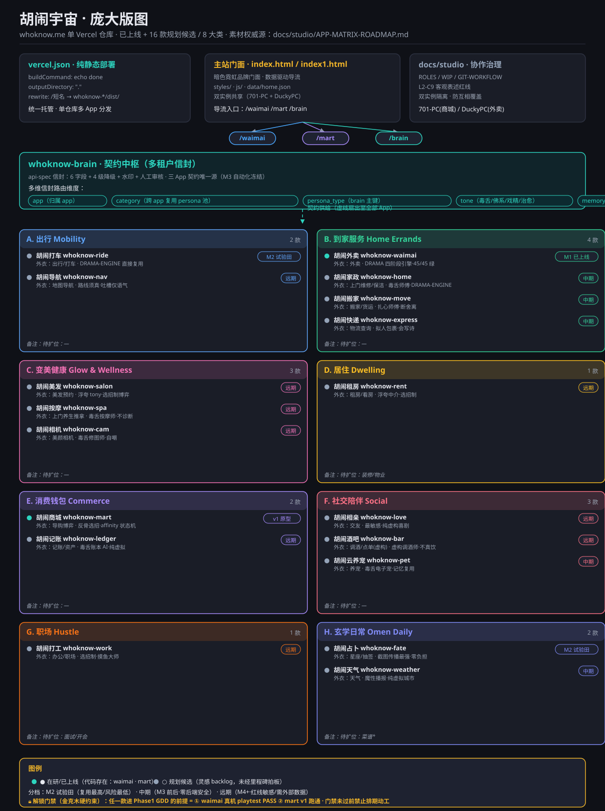

# 胡闹宇宙 · 庞大版图（项目结构总图）

> 生成：2026-09-03 · 主理人视角汇编 · 配套矢量图：[`universe-map.svg`](./universe-map.svg)
> 素材权威源：[`APP-MATRIX-ROADMAP.md`](./APP-MATRIX-ROADMAP.md)（候选矩阵）、[`胡闹宇宙总体设计方案.md`](../../胡闹宇宙总体设计方案.md)（总纲 v3）、[`PROJECT-STATUS.md`](./PROJECT-STATUS.md)（根状态锚）
> 性质：**结构全景图 + 规划版图**，非执行计划。规划中的 16 款均为灵感 backlog。

---

## 0. 一句话总览

`whoknow.me` 是**单 Vercel 仓库托管的胡闹 App 矩阵**：纯静态部署分发，主站门面导流，三款已落地 App（外卖/商城/大脑）跑通范式，另有 **16 款规划候选按 8 大类聚类**，统一由 `whoknow-brain` 契约中枢以「多租户信封」供给人格/台词/红线闸门。

---

## 1. 版图（矢量图）



*图例见 SVG 底部：● 在研/已上线 · ○ 规划候选；分档 M2 试验田 / 中期 / 远期；🔒 解锁门禁为金克木硬约束。*

---

## 2. 三层结构与关系

```
┌──────────────────────────────────────────────────────────────┐
│  部署底座                                                        │
│  vercel.json(纯静态 echo done) · 主站门面(index.html) · docs/studio │
└───────────────┬──────────────────────────────────────────────┘
                │ 导流（实线琥珀）：主站 → /waimai /mart /brain
┌───────────────▼──────────────────────────────────────────────┐
│  whoknow-brain · 契约中枢（多租户信封）                          │
│  api-spec：6 字段 + 4 级降级 + 水印 + 人工审核                    │
└───────────────┬──────────────────────────────────────────────┘
                │ 契约供给（虚线青色·扇出至全部 App）
┌───────────────▼──────────────────────────────────────────────┐
│  App 矩阵 · 8 大类 × 16 款（虚实同框）                          │
└──────────────────────────────────────────────────────────────┘
```

### 2.1 三处关键关系（图里显形）

1. **导流路由（实线琥珀）**：主站门面 → 三个路由 `/waimai` `/mart` `/brain`，由 `vercel.json` 的 rewrite 统一托管分发。
2. **契约供给（虚线青色）**：`whoknow-brain` 作为契约中枢，反向把 `api-spec` 信封供给给所有 App —— 它是把 16 款串成"宇宙"的关键关系。
3. **双实例隔离**：`docs/studio`（ROLES/WIP/GIT-WORKFLOW/L2-C9）把 701-PC（mart+brain）与 DuckyPC（waimai+主站）隔开，防互相覆盖。

### 2.2 各模块具体功能

| 模块 | 路径 | 状态 | 核心功能 |
|---|---|---|---|
| 主站门面 | `index.html`/`index1.html` + `styles/`+`js/`+`data/` | 已上线 | 暗色霓虹品牌门面、数据驱动导流、index1.html 备选部署 |
| whoknow-waimai | `whoknow-waimai/` | **M1 已上线 `/waimai`** | DRAMA 四阶段戏精引擎、记忆分级+12 成就、5 店/3 骑手 NPC、45/45 单测绿 |
| whoknow-mart | `whoknow-mart/` | **v1 原型上线 `/mart`** | 反骨导购博弈、5 导购×4 招克制矩阵、affinity 破防状态机、双重胜利态、数值待 playtest |
| whoknow-brain | `whoknow-brain/` | 契约中枢（手动） | api-spec 信封、4 级降级+水印、人工审核、三 App 契约唯一源（M3 冻结） |
| docs/studio | `docs/studio/` | 协作治理 | ROLES/WIP/GIT-WORKFLOW + L2-C9 红线，双实例隔离 |

---

## 3. 8 大类 × 16 款完整清单

> ● = 在研/已上线（代码存在）　○ = 规划候选（灵感 backlog）
> 分档：**M2 试验田**（复用最高/风险最低）· **中期（M3 前后）**（零后端安全）· **远期（M4+）**（红线敏感/需外部数据）

| 大类 | 成员 App | 外衣品类 | 复用度 | 分档 | 玩法爆点 |
|---|---|---|---|---|---|
| **A 出行** | ○ 胡闹打车 `whoknow-ride` | 出行/打车 | ★★★★★ | M2 | 抽司机 persona，DRAMA 四阶段+选招制，魔性评价页 |
| | ○ 胡闹导航 `whoknow-nav` | 地图导航 | ★★ | 远期 | 真实路线+毒舌旁白，HUD 吐槽气泡 |
| **B 到家服务** | ● 胡闹外卖 `whoknow-waimai` | 外卖 | — | M1 已上线 | DRAMA 引擎+记忆分级+12 成就 |
| | ○ 胡闹家政 `whoknow-home` | 上门维修/保洁 | ★★★ | 中期 | 毒舌师傅实时气泡，虚构订单 |
| | ○ 胡闹搬家 `whoknow-move` | 搬家/货运 | ★★★ | 中期 | 师傅吐槽囤积物品，断舍离梗 |
| | ○ 胡闹快递 `whoknow-express` | 物流查询 | ★★ | 中期 | 包裹拟人化自述，会写诗 |
| **C 变美健康** | ○ 胡闹美发 `whoknow-salon` | 美发预约 | ★★★ | 远期 | 浮夸 tony 推销+选招制博弈 |
| | ○ 胡闹按摩 `whoknow-spa` | 上门养生推拿 | ★★ | 远期 | 按摩师毒舌点评体态，不诊断 |
| | ○ 胡闹相机 `whoknow-cam` | 美颜相机 | ★★ | 远期 | 毒舌修图师实时点评，自嘲 |
| **D 居住** | ○ 胡闹租房 `whoknow-rent` | 租房/看房 | ★★★ | 远期 | 浮夸中介房源描述，选招制砍价 |
| **E 消费钱包** | ● 胡闹商城 `whoknow-mart` | 导购博弈 | — | v1 原型 | 反骨选招+affinity 破防状态机 |
| | ○ 胡闹记账 `whoknow-ledger` | 记账/资产 | ★★★ | 远期 | 毒舌账本 AI 月报，纯虚拟 |
| **F 社交陪伴** | ○ 胡闹相亲 `whoknow-love` | 交友 | ★★★☆ | 远期 | 滑卡+奇葩反应，最敏感走纯虚构 |
| | ○ 胡闹酒吧 `whoknow-bar` | 调酒/点单(虚构) | ★★★ | 远期 | 虚构调酒师按心情调酒，不真饮 |
| | ○ 胡闹云养宠 `whoknow-pet` | 养宠 | ★★★★★ | 中期 | 毒舌电子宠，记忆引擎直接复用 |
| **G 职场** | ○ 胡闹打工 `whoknow-work` | 办公/职场 | ★★★★☆ | 远期 | 选招制博弈处理荒诞任务，摸鱼大师 |
| **H 玄学日常** | ○ 胡闹占卜 `whoknow-fate` | 星座/抽签 | ★★★★☆ | M2 | 离谱卦象+躺平宜忌，截图最强 |
| | ○ 胡闹天气 `whoknow-weather` | 天气 | ★★★☆ | 中期 | 魔性播报，纯虚拟城市 |

**附加候选（第三波）**：胡闹菜谱 `whoknow-recipe`（披下厨房外衣的离谱菜谱，远期，需虚构菜谱内容）。
**聚类空缺待补**：内容创作类（Vlog/日记）、学习教育类（背单词/网课·去焦虑化）、医疗虚拟化类（养生问诊·极重度虚拟化）。

---

## 4. 契约中枢：brain 多租户信封

把 `whoknow-brain` 从单租户（waimai）扩成多租户，是总纲要求的「空扩展点」：

| 维度 | 取值示例 | 价值 |
|---|---|---|
| `app` | `waimai`/`ride`/`fate`/`pet` | 标识内容归属 |
| `category` | `home_errands`/`mobility` | 跨 app 复用 persona 池（B 类共享 `service_worker`） |
| `persona_type` | `rider`/`repairman`/`bartender`/`package_ghost` | brain persona 池主键，定义一次多 app 引用 |
| `tone` | `毒舌`/`佛系`/`戏精`/`治愈` | 同 persona_type 跨 app 换 tone |
| `memory_scope` | `["consumption_habit","frequency"]` | 跨 app 聚合画像，通用吐槽素材 |
| `fiction_flag` | `booking_none`/`order_fiction` | 设计宪法机器可校验闸门，硬拒真下单/真支付 |

**落地收益**：新增一款 app = 注册 `persona_type`（或复用已有）+ 选 `category`/`tone`/`fiction_flag`，persona 与记忆分级自动继承；`category`/`tone` 让跨 app 联动吐槽（宇宙级互文）成为可能。
**归属**：此项归 701-PC / Agent-商城执行，须在 v2 跑通后随 M3 自动化推进，当前仅作设计预留。

---

## 5. 解锁门禁（金克木硬约束）

> **🔒 任一款进入 Phase 1 GDD 正式开发的前提 = ① waimai 真机 playtest 硬闸门 PASS（总纲行动项 C 仍 OPEN）② mart v1 跑通验证。门禁未过前，全部候选只埋空扩展点、禁止排期动工。**

优先级路线图（金克木：先埋点，不铺工）：
- **M2 试验田**：胡闹打车 或 胡闹占卜（二选一，先跑通"第二款"验证矩阵可复制性）。
- **中期（M3 前后）**：云养宠、天气、B 类到家三件套（与 waimai 共享 service_worker persona，成簇成本最低）。
- **远期（M4+）**：打工、相亲、美发、按摩、记账、租房、导航、酒吧、相机、菜谱（红线敏感或需外部数据，等生态成熟按类成簇解锁）。

---

## 6. 风险与红线（速记）

- 占卜/相亲：不制造焦虑、不人身攻击、不物化；占卜限躺平宜忌+免责，相亲走纯虚构喜剧。
- 导航/家政：路线须真、吐槽仅语气；家政故障纯虚构不教维修。
- 按摩/记账/酒吧：spa 不做诊断声称；ledger 不接真账户/不给投资建议；bar 明确虚构不真饮。
- 天气/菜谱：改纯虚拟城市/虚构菜谱，规避外部数据依赖。
- brain 多租户：沿用 ADR-001 数据形状权威，`meta` 维度纯增量、向后兼容，`fiction_flag` 作硬闸门。

---

*本版图随 APP-MATRIX-ROADMAP.md 演进，任何新候选须经里程碑拍板方可从 ○ 转为 ●。*
