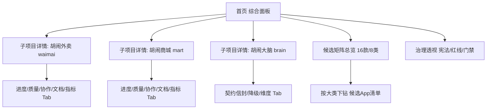

# 胡闹宇宙项目开发工作台 · 产品需求文档（PRD）

> 交付人：产品经理 许清楚（Xu）｜团队：software-hunao-workbench
> 依据：前期竞品工作台调研 + 本项目数据资产盘点（根目录 `D:\AI-Project\whoknow.me`）
> 约束：本报告为方案文档，**零实现代码**，仅含调研、数据口径与设计约定。

---

## 一、竞品调研发现

调研对象：Linear、Jira（Portfolio/Advanced Roadmaps）、Vercel Dashboard、GitHub Projects/Insights、Plane、Height、Notion 数据库/看板、飞书项目、TAPD、Backstage（IDP）。

### 1.1 综合 / 总览面板（Portfolio Overview）常见模块

| 模块 | 代表产品 | 在本项目的映射价值 |
|---|---|---|
| 全局进度/完成度 | Linear Initiative、Jira Portfolio、飞书项目总览 | 宇宙整体进度条 + 各 App 完成度 |
| 里程碑/路线图甘特 | Jira Advanced Roadmaps、Plane Timeline | 16 候选 App 解锁路线图时间轴 |
| 健康度/状态灯 | Vercel Dashboard、TAPD 健康分 | 红/黄/绿 三态（已上线/设计中/规划中） |
| 风险/阻塞项 | Jira Risk、飞书风险看板 | 红线清单、金克木冻结、playtest 闸门 |
| 资源/负载 | Linear、飞书人效 | 双实例（701-PC / DuckyPC）分工负载 |
| 指标卡（DORA） | 飞书项目、TAPD、Vercel | 部署频率、构建通过率、MTTR |
| 贡献活跃度 | GitHub Insights（Pulse/Contributors） | git 提交频率、作者分布 |

### 1.2 子项目详情页常见模块

| 模块 | 代表产品 | 在本项目的映射价值 |
|---|---|---|
| 任务流/看板 | Linear、Plane、GitHub Projects | 各 App 七阶段（waimai 模式）进度 |
| 进度明细 | Jira Epic、Notion DB | 测试 45/45、Phase5 12/12 等质量门 |
| CI / 构建状态 | Vercel Dashboard、GitHub Actions | 构建 PASS/FAIL、单测绿/红 |
| 成员/协作 | Linear、飞书 | 双实例 Agent 归属与 lane 状态 |
| 文档/契约 | Backstage Catalog、Notion | brain 信封契约、api-spec 文档 |
| 指标卡 | TAPD、飞书 | 笑率、留存、playtest 数据 |

### 1.3 常用图表类型及适用场景

| 图表 | 适用场景 | 本项目落点 |
|---|---|---|
| 折线图 | 趋势（提交频率、笑率曲线） | 开发活跃度趋势、playtest 曲线 |
| 柱状图 | 对比（各 App 完成度） | App 间进度横向对比 |
| 饼/环图 | 占比（状态分布） | 3 已上线 vs 16 规划占比 |
| 雷达图 | 多维能力（健康度） | 单 App 五维健康（进度/质量/风险/协作/商业） |
| 热力图 | 活跃时段/目录提交密度 | git 目录提交热力（waimai 62 / mart 17 …） |
| 燃尽图 Burndown | 剩余工作量 | 阶段剩余任务 |
| 甘特图 Gantt | 里程碑排期 | 候选矩阵解锁路线图 |
| 漏斗图 Funnel | 转化（playtest→上线） | 候选 App 推进漏斗 |
| CFD 累积流图 | 吞吐/在制 | 阶段累积交付 |
| 交通灯状态图 | 一票否决 | 红线/宪法 L1 状态灯 |

### 1.4 信息架构与导航模式

- **侧边栏 Sidebar**：左栏固定一级导航（首页/各 App/候选矩阵/治理文档）。
- **标签页 Tab**：子项目详情页内切「进度 / 质量 / 协作 / 文档 / 指标」分页。
- **面包屑 Breadcrumb**：首页 › 子项目 › 阶段，支持快速回跳。
- **下钻 Drill-down**：总览卡片点击 → 子项目详情；矩阵簇点击 → 候选 App 清单。
- **Backstage 启示**：单仓多 App 建议用 `catalog-info.yaml` 注册 Component，路径感知评分（Scorecard）自动校验——对本项目「单 Vercel 仓多 App」极具借鉴意义。

### 1.5 可借鉴设计模式（关键启发）

1. **Portfolio 总览 + 子项目下钻**：一套面板同时服务「宇宙全局」与「单 App 深查」，避免两套系统。
2. **交通灯 + 宪法闸门绑定**：将 L1 真铁律 / 红线清单直接映射为状态灯，红灯即阻塞，与 `forbidden_check` 闸门口径一致。
3. **质量门即数据卡**：把 waimai「45/45 单测绿」「mart Phase5 PASS-with-CONCERNS」固化为可展示质量门卡片，而非埋在文档里。
4. **契约即资产视图**：brain 信封 6 字段 + 4 级降级作为「契约中枢」专属可视化模块，直观呈现多租户维度。
5. **贡献热力 + 双实例负载**：用 git 提交热力图呈现 701-PC / DuckyPC 分工与负载均衡，呼应 ROLES.md 协作章程。

---

## 二、项目数据资产盘点

工作根目录：`D:\AI-Project\whoknow.me`（只读调研，未改动任何文件）

### 2.1 现有可展示数据维度（真实、可直接取用）

| 数据维度 | 取值/口径 | 来源 |
|---|---|---|
| App 状态 | 胡闹外卖 `live`🟢 / 胡闹导购 `designing` / 胡闹大脑 `planning` | `data/home.json` |
| waimai 里程碑 | M1 七阶段全 ✅，已上线 `/waimai` | `INDEX.md`、`PROJECT-STATUS.md` |
| waimai 测试 | 45/45 单测绿 + 构建 PASS | `PROJECT-STATUS.md`、Bash 测试文件清单 |
| mart 状态 | 概念阶段→v1 原型，Phase5 PASS-with-CONCERNS（npm test 12/12，ci 四关绿） | `INDEX.md`、`PHASE5-QA.md` |
| brain 状态 | 手动信封（v2.1 架构），P0-C 自动化暂停 | `PROJECT-STATUS.md`、`api-spec.md` |
| 候选矩阵 | 16 款候选 / 8 大类（●在研 vs ○规划） | `APP-MATRIX-ROADMAP.md`、`UNIVERSE-MAP.md` |
| 解锁门禁 | waimai 真机 playtest PASS + mart v1 跑通 | `APP-MATRIX-ROADMAP.md` |
| 契约信封维度 | app/category/persona_type/tone/memory_scope/fiction_flag + 4 级降级 | `api-spec.md` |
| 双实例分工 | 701-PC(mart+brain) / DuckyPC(waimai+主站) | `ROLES.md`、`INDEX.md §8` |
| 红线清单 | §2 红线（L1 真铁律 5 条） | `INDEX.md`、`CONSTITUTION.md` |
| 宪法分级 | L1 真铁律(5)/L2 强约定(9)/L3 当前纪律(8) | `CONSTITUTION.md` |
| git 总量 | 164 提交；分支 agent-mart/agent-waimai/main | Bash `git` |
| 目录提交分布 | waimai 62 / docs 26 / index 35 / mart 17 / brain 11 | Bash `git` |
| 作者分布 | Ducky Tan 86 / duckytan 41 / unknown 37 | Bash `git` |
| 提交日期分布 | 2026-07-26×23、07-28×1、08-31×3、09-01×3 | Bash `git` |
| 主站门面 | `index.html` + `data/home.json` reviews 数组 | 根目录 |

### 2.2 数据缺口（当前无法直接取用，需采集/解析/手动维护）

| 缺口 | 现状 | 补数方式建议 |
|---|---|---|
| git 提交频率/活跃度 | 仅有总量，无按周/按人的时间序列 | 解析 git log 生成周频/热力 |
| 构建状态/CI 结果 | 无 CI 平台，靠本地 `npm run ci` | 接入 Vercel/CI 或读 `ci-check.mjs` 结果落盘 |
| 实时进度百分比 | 阶段状态为布尔/文本，无百分比 | 约定阶段权重 → 计算完成度 |
| playtest 真机数据 | 闸门口径待拍板（A/B/C），无数据 | 建 playtest 采集模板 |
| brain 信封自动化状态 | P0-C 暂停，仅手动 | 看板状态字段维护 |
| 笑率/留存等业务指标 | Phase5 仅人测 CONCERNS | 埋点/人工录入 |
| ⚠️ 数据口径冲突点 | `ROLES.md §6.5` 称 DuckyPC 已将 brain src 提交 origin/main（32 commits），但磁盘 `ls-tree main` 显示 whoknow-brain 仅含 `docs/`，无 src 实现 | **待核实**：以磁盘为准还是以章程为准，需 DuckyPC 拍板 |

### 2.3 盘点结论

- 当前**可立即展示**的是「状态 / 里程碑 / 测试质量门 / 候选矩阵 / 契约维度 / 双实例分工 / 红线宪法 / git 总量」——足以支撑首页综合面板 MVP。
- **需建设采集层**的是「提交时间序列、CI 状态、实时进度%、playtest 数据、业务指标」——列为 P1 待建数据管道。
- 存在 1 处**口径冲突**（brain src 是否存在），须在 PRD 待确认问题中显式标注。

---

## 三、PRD（胡闹宇宙项目开发工作台）

### 3.1 产品目标与用户

**Product Goals（3 个正交目标）**
1. **全局可视（Global Visibility）**：一屏掌握胡闹宇宙整体进度、健康度、风险与候选矩阵，降低多 App 信息碎片化。
2. **单 App 深查（Drill-down Clarity）**：每个子项目独立页面呈现开发/测试/构建/风险明细，让双实例协作状态透明。
3. **治理可溯（Governance Traceability）**：把宪法红线、金克木冻结、解锁门禁、契约信封固化为可视图，使「扩展纪律」可见可查。

**User Stories**
- 作为**主理人（齐活林）**，我希望在首页看到宇宙整体进度与红灯风险，以便快速决策是否解锁新 App。
- 作为**Agent-商城（701-PC）**，我希望在 mart/brain 详情页看到自己的阶段质量门与协作 lane，以便推进不踩线。
- 作为**Agent-外卖（DuckyPC）**，我希望在 waimai 详情页看到 45/45 测试与构建状态，以便确认 M1 稳健。
- 作为**PM（许清楚）**，我希望候选矩阵按 8 大类聚类展示解锁路线图，以便对外同步规划。
- 作为**协作者**，我希望点击总览卡片能下钻到对应 App 详情，以便少跳转获取明细。

### 3.2 信息架构

- **导航**：左侧 Sidebar（首页 / waimai / mart / brain / 候选矩阵 / 治理透视）；子项目页内 Tab 分页；顶部 Breadcrumb 回跳。
- **下钻路径**：首页卡片 → 子项目详情；候选矩阵簇 → 候选 App 清单。

### 3.3 首页综合面板功能清单

| 模块 | 数据维度（来源） | 图表类型 | 优先级 |
|---|---|---|---|
| 宇宙整体进度 | 各 App 完成度（2.1 状态口径） | 进度条 + 环图 | P0 |
| App 状态灯 | live/designing/planning（home.json） | 交通灯状态图 | P0 |
| 里程碑/解锁路线图 | 16 候选 8 类 + 门禁（ROADMAP） | 甘特图 | P0 |
| 候选矩阵聚类 | 8 大类 ●/○（UNIVERSE-MAP） | 矩阵卡片/漏斗 | P0 |
| 健康度雷达 | 进度/质量/风险/协作/商业五维 | 雷达图 | P1 |
| 风险/红线看板 | L1 真铁律 5 条 + 金克木冻结 | 交通灯 + 列表 | P0 |
| 双实例负载 | 701-PC/DuckyPC 目录提交分布 | 柱状图 + 热力图 | P1 |
| 贡献活跃度 | git 周频（缺口→采集） | 折线图 | P1 |
| 质量门总览 | waimai 45/45、mart 12/12 | 指标卡 | P0 |
| 契约中枢透视 | brain 信封 6 字段 + 4 级降级 | 维度表/树 | P1 |

### 3.4 子项目详情页功能清单（以 waimai / mart / brain 为模板）

| Tab | 模块 | 数据维度（来源） | 图表/控件 | 优先级 |
|---|---|---|---|---|
| 进度 | 七阶段里程碑 | M1 七阶段全 ✅（INDEX） | 阶段步进条 | P0 |
| 质量 | 测试/构建门 | 45/45 绿、Phase5 12/12（STATUS/PHASE5） | 指标卡 + 绿红点 | P0 |
| 协作 | 双实例 lane | ROLES.md §6.5 归属 | 成员/归属标签 | P1 |
| 文档 | 契约/规格 | api-spec.md、gdd | 文档链接卡 | P1 |
| 指标 | DORA/业务 | 部署频率、笑率（缺口） | 指标卡 + 折线 | P2 |
| brain 专属 | 信封维度 | 6 字段 + 4 级降级 + 水印 | 维度树 + 降级流 | P1 |
| brain 专属 | 自动化状态 | P0-C 暂停（STATUS） | 状态灯 | P0 |

### 3.5 数据维度清单（字段级）

**A. 自动采集（可解析现有资产）**
- `app_key`（waimai/mart/brain）、`app_status`（live/designing/planning）、`milestone_phase`（1-7）、`test_pass`（int）、`test_total`（int）、`build_status`（PASS/FAIL）、`git_commits_total`（int）、`git_commits_by_dir`（map）、`git_author_dist`（map）、`candidate_count`（16）、`candidate_categories`（8）、`unlock_gate_status`（bool）。

**B. 手动维护（文档驱动，需专人更新）**
- `health_score`（五维）、`playtest_result`（A/B/C 口径）、`brain_envelope_automation`（P0-C 状态）、`redlight_list`（L1 5 条）、`constitution_level`（L1/L2/L3）、`dual_instance_load`（701/Ducky）。

**C. 待建采集（需新管道）**
- `commit_timeseries`（周频）、`ci_result`（Vercel/CI）、`realtime_progress_pct`（阶段权重计算）、`playtest_metrics`（真机）、`biz_metrics`（笑率/留存）、`mtbf/mttr`（DORA）。

### 3.6 待确认问题（Open Questions）

1. **技术栈**：是否复用现有 Vue3+Vite+Vant+Pinia 栈，还是独立 Vite+React+MUI+Tailwind？工作台为「内部治理工具」，建议轻量独立栈避免污染 App 矩阵。
2. **数据来源方式**：git 统计靠脚本定时解析还是接 CI Webhook？首页 MVP 阶段建议脚本离线解析 + JSON 落盘。
3. **静/动态**：MVP 是否接受「半静态」（手动维护 + 定时脚本刷新），还是必须实时拉取？
4. **brain src 口径冲突**：`ROLES.md §6.5` 与磁盘 `ls-tree` 不一致，以何为准？影响 brain 详情页「实现进度」字段。
5. **playtest 闸门口径**：A 轻量 / B 自然回收 / C 全量，何时拍板？决定质量门数据卡定义。
6. **宪法红线可视化粒度**：L1 真铁律是否逐条绑定状态灯，还是仅整体红/黄/绿？
7. **扩展纪律**：金克木冻结期间，工作台是否仅展示「空扩展点」而不开放新建 App 入口？

---

> **交付边界声明**：本报告严格遵循「严禁写实现代码」约束，未生成任何 `.vue/.ts/.js` 源码文件，仅产出调研、盘点与方案文档（Markdown）。下一步建议由架构师据本 PRD 的「待确认问题」拍板后进入技术方案设计。
