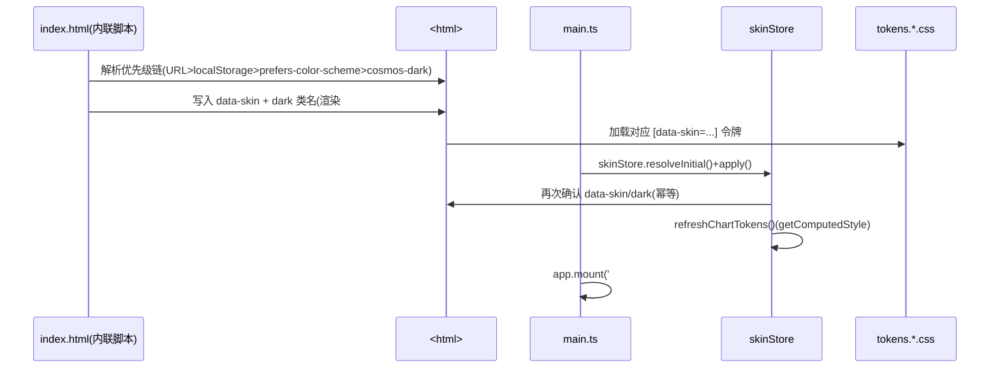

# 胡闹宇宙 · 开发工作台 · 换肤改造 系统设计方案（ARCHITECTURE）

> 交付角色：架构师 高见远（Gao）｜团队：software-workbench-skin
> 文档定位：方案文档，**零实现代码**；承 PRD.md v1.0（事实基准日 2026-09-05，分支 `b26d9bd`）
> 事实基准日：**2026-09-05**；约束来源：`CONSTITUTION.md` L2-C5（品牌视觉规范）、L2-C9（客观表述红线）、`BRAND.md` §2 / §3 / §6 / §12 / §13 / §17
> 配套输入：`PRD.md`、`BRAND.md`、`CONSTITUTION.md`、现有 `src/`（21 组件 + 5 页面 + `App.vue`）、`styles/design-tokens.css`

---

## 〇、决策结论摘要（含取舍理由）

下表为 6 项技术难点的拍板落地结论与依据。第 (7)(8) 两项为 PRD 待确认问题已由主理人 duckytan 于 2026-09-05 拍板，此处复述为设计约束。

| # | 难点 | 结论 | 取舍理由 |
|---|---|---|---|
| 1 | 令牌同步到 JS（ECharts 跟随主题） | **CSS 变量为唯一真源 + `getComputedStyle` 运行时解析**。`palette.ts` 仅保留 `BRAND_ANCHORS`（三锚色）+ 一组「CSS 变量名引用」常量；`resolveChartTokens()` 在皮肤切换后读取 `--chart-*` 容器令牌，返回 canvas 可用的具体色值。 | ECharts canvas 渲染**读不了 CSS 变量**（`BarChart.vue:49`、`RingChart.vue:49` 的 `fontFamily` 字符串与 `setOption` 色值均需具体色）。把容器色放在 CSS 里可保证「单一真源」，且避免 TS 侧双份维护漂移。锚色/数据序列色两皮肤共用不变（`CHART_PALETTE`）。 |
| 2 | Element Plus 跟随主题 + 按需引入 | **`unplugin-vue-components` + `unplugin-auto-import`（ElementPlusResolver）做按需**；`main.ts` 移除全量 `app.use(ElementPlus)` 与两个完整 CSS，仅保留 `import 'element-plus/theme-chalk/dark/css-vars.css'`（仅含 CSS 变量，体积极小）；`--el-*` 双份覆盖挂 `html.dark`（深色）与 `html:not(.dark)`（浅色）。 | PRD R-P0-04 与拍板「EP 改按需」。双份 `--el-*` 指向 `--wb-*`，由 `data-skin` 驱动的 `dark` 类名切换作用域。locale 接法为**待验证项**（见 §7 / 待明确事项）。 |
| 3 | 区域布局引擎 | **三层注册表**（Module → Region → Layout Variant）。`src/skins/registry.ts` 编译期类型安全；`SkinPage.vue` 单一入口替换 `HomeDashboard.vue` 的 6 组硬编码 `el-row/el-col`（`HomeDashboard.vue:42-68`）。 | PRD R-P0-06 与 Q10 拍板（注册表放 `src/skins/`，与 `public/data/` 隔离）。新增变体 = 写 Vue 布局组件并登记；选变体/调映射/调密度 = 改 JSON（配置动作）。 |
| 4 | 硬编码色值收敛 | 54 处 / 45 行 / 13 文件，按「先令牌层 → 再 chart → 再 format/组件」顺序收敛为 `var(--wb-*)`；`App.vue:204` 的 `#0f1117` 等随 `global.css` 重写一并清零。 | PRD R-P0-01 验收 `grep` 命中 = 0。先立令牌再消硬编码，避免半途无变量可引用。 |
| 5 | 字体自托管与子集化 | **自托管 woff2 + `fonttools`（`pyftsubset`）构建期子集化**；中文字体（Noto Sans SC / ZCOOL 庆科黄油体）按工作台实际用到的汉字白名单子集化；`fonts.css` 用 `@font-face` + `font-display: swap`；`index.html` 用 `<link rel="preload">`。 | PRD R-P0-05 与 Q4 拍板（不放 CDN）。中文全量 woff2 数 MB，会撑大需提交 git 的 `dist/`，必须子集化。禁柳建毛草（L2-C5）以 `grep` 校验留痕。 |
| 6 | 无障碍硬闸门 | 两套皮肤 × 5 页面过 `BRAND.md` §17；`App.vue:189` 导航链接 27px → 修复至 ≥44px；紫色 `#8b5cf6` 作为文字底色预留对比度校验环节（axe-core devDep）；`prefers-reduced-motion` 覆盖新增组件。 | PRD R-P0-07。状态不独载颜色：`StatusLight.vue:31-32` 已含 `label`/`caption` 双字段，需确保 `label` 始终渲染。 |
| 7 | 首屏防闪 | `index.html` `<head>` 增加约 10 行同步内联脚本，于 `<div id="app">` 渲染前写入 `data-skin` 与 `dark` 类名。 | Q7 拍板接受。优先级链：`URL ?skin=` > `localStorage['wb.skin']` > `prefers-color-scheme` > 默认 `cosmos-dark`。 |
| 8 | legacy 回滚 | 新增 `legacy` 令牌集（精确保留 2026-09-05 中性冷灰 `#0f1117`/`#171a23`/`#262b36`/`#79819a`），`?skin=legacy` 可切，P1 完成后移除。 | Q9 拍板纳入 P0。令牌集保留一份 `legacy`，作为对照与回滚出口。 |

---

## 一、文件清单（新增 / 修改，含职责一句话）

### 1.1 令牌与字体层

| 路径 | 动作 | 职责 |
|---|---|---|
| `src/styles/tokens.css` | 新增 | 锚色层（`--wb-green/orange/purple` 等）+ 语义层骨架（`--wb-bg/panel/text/...`）+ 字号角色（`--wb-font-display/title/body/mono`）+ 间距/圆角/阴影/光晕（`--shadow-glow-*`、`--glow-*`）+ 图表容器令牌（`--chart-*`） |
| `src/styles/fonts.css` | 新增 | 5 套字体 `@font-face`（woff2 + `font-display: swap`）+ 回退栈 |
| `src/styles/global.css` | 修改 | 重写 `:root` 18 个 `--wb-*`（删除中性冷灰，改由令牌层经 `data-skin` 注入）；双份 `--el-*` 覆盖（`html.dark` 与 `html:not(.dark)`）；`.wb-mono` 改 `var(--wb-font-mono)`；`reduced-motion` 覆盖面扩展 |
| `src/skins/tokens.cosmos-dark.css` | 新增 | 宇宙暗色语义层取值（BRAND §2.2）+ 光晕 + 低光晕阴影，挂 `[data-skin="cosmos-dark"]` |
| `src/skins/tokens.paper-light.css` | 新增 | 产品浅色语义层取值（BRAND §2.3）+ 标准投影，挂 `[data-skin="paper-light"]` |
| `src/skins/tokens.legacy.css` | 新增 | 2026-09-05 中性冷灰精确复刻，挂 `[data-skin="legacy"]` |
| `src/assets/fonts/*.woff2` | 新增 | 子集化后字体文件（构建产物，随 `dist/` 提交） |

### 1.2 皮肤状态层

| 路径 | 动作 | 职责 |
|---|---|---|
| `src/skins/types.ts` | 新增 | `SkinConfig` / `SkinPageConfig` / `RegionMapping` / `ModuleSlot` / `LayoutVariantId` / `Density` / `SkinId` 等 TS 类型 |
| `src/skins/registry.ts` | 新增 | `MODULE_REGISTRY`（21 组件 id→组件）、`LAYOUT_REGISTRY`（变体 id→布局组件）、`SKIN_REGISTRY`（skin id→`SkinConfig`） |
| `src/skins/validate.ts` | 新增 | 皮肤 JSON schema 校验 + 业务数据污染检测（禁止出现 `metrics.json`/`manual.json` 数值字符串） |
| `src/skins/cosmos-dark.json` / `paper-light.json` / `legacy.json` | 新增 | 三套皮肤的布局/字体/密度声明 |
| `src/stores/skin.ts` | 新增 | Pinia store：当前 `skinId`、解析后 `chartTokens`、布局/密度覆盖、`persist` 与 `apply()` |
| `src/composables/useSkin.ts` | 新增 | 组件侧读取/切换皮肤的封装（封装优先级链与 `localStorage`） |
| `src/main.ts` | 修改 | 挂载前调用 `skinStore.apply()`；EP 改按需引入（移除全量 CSS 与 `app.use(ElementPlus)`，保留 dark css-vars） |
| `index.html` | 修改 | `<head>` 内联同步脚本写入 `data-skin`/`dark` 类；`class="dark"` 改由脚本注入；字体 `preload` |

### 1.3 图表层

| 路径 | 动作 | 职责 |
|---|---|---|
| `src/components/charts/palette.ts` | 修改 | 仅留 `BRAND_ANCHORS` + `CHART_PALETTE_VARS`（CSS 变量名数组）+ `CONTAINER_TOKEN_VARS`；新增 `resolveChartTokens()` 经 `getComputedStyle` 解析 |
| `src/components/charts/useChart.ts` | 修改 | `useChart` 增加 `skin` 依赖，皮肤切换时触发 `render()` 重绘（复用 L24 `setOption(...,{notMerge:true})`） |
| `src/components/charts/{Bar,Funnel,Heatmap,Radar,Ring}Chart.vue` | 修改 | 11 处硬编码 hex → 经 `resolveChartTokens()` 读取；`RingChart.vue:49` fontFamily → `var(--wb-font-mono)` 常量 |
| `src/services/format.ts` | 修改 | `GANTT_COLOR`（L175-180）4 处 hex → `var(--wb-*)`（锚色家族） |

### 1.4 布局注册表与页面

| 路径 | 动作 | 职责 |
|---|---|---|
| `src/components/SkinPage.vue` | 新增 | 按 `page` 读取皮肤配置 → 解析 layout 变体 → 渲染 `ModuleHost` 区域；未知 layout→降级 `home-classic`+`console.warn`；未知 module→占位块 |
| `src/components/ModuleHost.vue` | 新增 | 按 `module` id 从 `MODULE_REGISTRY` 解析组件并渲染，带 `variant` prop；未注册→「模块未注册：<id>」 |
| `src/skins/layouts/HomeClassic.vue` | 新增 | `home-classic` 变体（六行栅格令牌化等价版，默认 `paper-light`） |
| `src/skins/layouts/HomeSpotlight.vue` | 新增 | `home-spotlight` 变体（hero+rail+timeline+pairL/pairR+四联+footer，默认 `cosmos-dark`） |
| `src/skins/layouts/HomeDense.vue` | 新增 | `home-dense` 变体（auto-fill minmax(320px,1fr) 瀑布，备用/Dev 面板可选） |
| `src/pages/HomeDashboard.vue` | 修改 | 移除 6 组硬编码 `el-row/el-col`（`HomeDashboard.vue:42-68`），改为 `<SkinPage page="home" />`；保留页头与 store 消费 |
| `src/skins/layouts/{DetailTabs,DetailStacked,MatrixGrid,MatrixList,GovPanel,GovFlat}.vue` | 新增（P1） | `AppDetail`/`CandidateMatrix`/`GovernanceView` 各 ≥2 变体（R-P1-03） |
| `src/pages/AppDetail.vue` / `CandidateMatrix.vue` / `CandidateList.vue` / `GovernanceView.vue` | 修改（P1） | 接入布局变体；移除 L503/L657 `--el-color-primary` 局部覆盖；4 处 `JetBrains Mono` → `var(--wb-font-mono)` |

### 1.5 配图 / 图标 / 氛围（P1，Q1 拍板全部 P0）

| 路径 | 动作 | 职责 |
|---|---|---|
| `src/components/common/WbIcon.vue` | 新增 | 自绘 SVG sprite 取用封装，零新增运行时依赖 |
| `src/assets/icons/*.svg` | 新增 | 功能图标集（24×24 网格，§13.1） |
| `src/assets/brand/wordmark.svg` | 新增 | Bungee `whoknow?` 字标（§12.1 / §12.4） |
| `src/components/SkinBackdrop.vue` | 新增 | 深色三处径向光晕层（`pointer-events:none`、`aria-hidden`） |
| `src/App.vue` | 修改 | L78 emoji `🛰️` → `WbIcon`/字标；导航链接触控区升至 ≥44px（L189）；挂载 `SkinBackdrop` |
| `src/components/modules/AppStatusLightsModule.vue`、`src/pages/AppDetail.vue`（L451 空态） | 修改 | 接入图标与空状态插图 |

### 1.6 Dev 面板（P1，Q1/Q2 拍板）

| 路径 | 动作 | 职责 |
|---|---|---|
| `src/components/SkinPanel.vue` | 新增 | 顶栏入口，可视化切换已注册布局变体 / 密度 / 模块显隐 / 导出 JSON（R-P1-01） |

### 1.7 工程脚本

| 路径 | 动作 | 职责 |
|---|---|---|
| `scripts/subset-fonts.mjs` | 新增 | 调用 `pyftsubset`（fonttools）按白名单子集化字体 → `src/assets/fonts/*.woff2` |
| `scripts/validate-skins.mjs` | 新增 | 构建前跑 `src/skins/validate.ts` 的 schema + 业务污染校验（可挂 `npm run build` 前或 `typecheck` 后） |

---

## 二、数据结构与接口

### 2.1 皮肤配置 JSON Schema（`src/skins/types.ts`）

```ts
// ── 基础原子类型 ──────────────────────────────
export type SkinId = 'cosmos-dark' | 'paper-light' | 'legacy';
export type LayoutVariantId = string;            // 受 LAYOUT_REGISTRY 约束（有限枚举）
export type Density = 'comfortable' | 'compact';
export type ModuleId = string;                   // 受 MODULE_REGISTRY 约束
export type RegionName = string;                 // 由布局变体组件内部定义（hero/rail/timeline/...）

export interface ModuleSlot {
  module: ModuleId;        // 指向 MODULE_REGISTRY
  variant?: string;        // 传给模块组件的展示变体（如 'spotlight' | 'row' | 'full'）
}

export interface SkinPageConfig {
  layout: LayoutVariantId; // 从 LAYOUT_REGISTRY 选取
  density: Density;
  regions: RegionMapping[];
}

export interface RegionMapping {
  region: RegionName;
  module: ModuleId;
  variant?: string;
}

export interface SkinFontRoles {
  // 皮肤层允许角色映射切换（PRD R-P0-05 表）
  display: string;   // 默认 'Bungee'
  title: string;     // cosmos-dark: ZCOOL；paper-light: 可切 Noto Sans SC 700
  body: string;      // 'Inter', 'Noto Sans SC'
  mono: string;      // 'JetBrains Mono'
}

export interface SkinConfig {
  id: SkinId;
  label: string;
  tokens: 'cosmos-dark' | 'paper-light' | 'legacy'; // 指向 tokens.*.css 的 data-skin 值
  fonts: SkinFontRoles;
  pages: Partial<Record<PageId, SkinPageConfig>>;
}

export type PageId = 'home' | 'detail' | 'candidates' | 'list' | 'governance';
```

### 2.2 注册表结构（`src/skins/registry.ts`）

```ts
import type { Component } from 'vue';
import type { SkinConfig, ModuleId, LayoutVariantId } from './types';

/** Module：21 个现有 .vue 组件登记；dataRequirements 可选，便于未来校验数据就绪 */
export interface ModuleEntry {
  component: Component;
  dataRequirements?: string[];
}
export const MODULE_REGISTRY: Record<ModuleId, ModuleEntry> = {
  UniverseProgressModule: { component: UniverseProgressModule },
  AppStatusLightsModule:  { component: AppStatusLightsModule },
  MilestoneGanttModule:   { component: MilestoneGanttModule },
  CandidateMatrixModule:  { component: CandidateMatrixModule },
  RiskBoardModule:        { component: RiskBoardModule },
  QualityGateModule:      { component: QualityGateModule },
  HealthRadarModule:      { component: HealthRadarModule },
  DualInstanceLoadModule: { component: DualInstanceLoadModule },
  ContributionActivityModule: { component: ContributionActivityModule },
  ContractHubModule:      { component: ContractHubModule },
  // …其余 11 个模块组件（含 pages 内复用的子模块）按 id 登记
};

/** Layout Variant：有限枚举，新增 = 写 Vue 布局组件 + 登记 */
export interface LayoutEntry {
  label: string;
  component: Component;
}
export const LAYOUT_REGISTRY: Record<LayoutVariantId, LayoutEntry> = {
  'home-classic':  { label: '经典六行', component: HomeClassic },
  'home-spotlight':{ label: '焦点式',   component: HomeSpotlight },
  'home-dense':    { label: '紧凑瀑布', component: HomeDense },
  // P1：detail-tabs / detail-stacked / matrix-grid / matrix-list / gov-panel / gov-flat
};

/** Skin：编译期导入三套 JSON */
export const SKIN_REGISTRY: Record<SkinId, SkinConfig> = {
  'cosmos-dark': cosmosDark,
  'paper-light': paperLight,
  'legacy': legacy,
};
```

### 2.3 skin store 接口（`src/stores/skin.ts`）

```ts
export const useSkinStore = defineStore('skin', () => {
  // ── 状态 ──
  const skinId: Ref<SkinId>;                 // 当前生效皮肤
  const chartTokens: Ref<ChartTokenSet>;     // 解析后的图表容器色（供 canvas）
  const layoutOverride: Ref<Record<string, { layout?: string; density?: Density; hidden?: string[] }>>;
                                             // Dev 面板覆盖，优先级高于 JSON、低于 URL
  // ── 派生 ──
  const config: ComputedRef<SkinConfig>;     // SKIN_REGISTRY[skinId]
  const density: ComputedRef<Density>;       // 解析最终密度（override > config > 默认）
  // ── 动作 ──
  function resolveInitial(): void;           // 按优先级链读取 URL/localStorage/prefers-color-scheme
  function apply(): void;                    // 写 <html data-skin> + dark 类 + 解析 chartTokens
  function setSkin(id: SkinId): void;        // 切换并持久化 localStorage['wb.skin']
  function refreshChartTokens(): void;       // getComputedStyle 重新解析 --chart-*
});
```

`chartTokens` 由 `palette.resolveChartTokens()` 产出，结构：

```ts
export interface ChartTokenSet {
  text: string;        // --chart-text
  muted: string;       // --chart-muted
  axisLine: string;    // --chart-axis-line
  splitLine: string;   // --chart-split-line
  tooltipBg: string;   // --chart-tooltip-bg
  tooltipBorder: string;// --chart-tooltip-border
  legend: string;      // --chart-legend
  series: string[];    // 由 CHART_PALETTE_VARS 解析出的具体色（两皮肤共用）
}
```

---

## 三、程序调用流程（Mermaid 时序图）

### 3.1 首屏冷启动（防闪）



### 3.2 运行时切换皮肤（完整链路）

```mermaid
sequenceDiagram
    participant UI as 切换器/SkinPanel
    participant STORE as skinStore
    participant DOC as <html>
    participant CSS as tokens.*.css
    participant CHART as 7×图表组件
    participant EP as Element Plus
    participant PAGE as SkinPage/布局变体

    UI->>STORE: setSkin('paper-light') / 布局覆盖
    STORE->>STORE: 持久化 localStorage['wb.skin']
    STORE->>DOC: 改写 data-skin='paper-light' + 移除 dark 类
    DOC->>CSS: [data-skin=paper-light] 语义层生效；html:not(.dark) --el-* 生效
    STORE->>STORE: refreshChartTokens()(getComputedStyle 读 --chart-*)
    STORE-->>CHART: chartTokens 变更(watch 触发)
    CHART->>CHART: render() → setOption(opt,{notMerge:true}) 重绘(≤1帧)
    EP->>DOC: dark 类名移除 → 浅色 --el-* 覆盖生效
    STORE-->>PAGE: config.pages[page].layout 变更(watch 触发)
    PAGE->>PAGE: 解析新 layout 变体 → 重排 ModuleHost 区域
    Note over CHART,EP,PAGE: 降级：未知 layout→home-classic+console.warn；未知 module→占位块
```

---

## 四、分文件改造策略（技术难点落地）

### 4.1 令牌同步到 JS（ECharts）——难点 (1)

**方案**：CSS 变量为唯一真源，`palette.ts` 不再持有容器色 hex。

`palette.ts` 改造后结构：

```ts
// 锚色：唯一集中声明处（PRD 验收「仅出现一处」）
export const BRAND_ANCHORS = {
  green: '#6eda78', orange: '#ff7849', purple: '#8b5cf6',
} as const;

// 数据序列色：两皮肤共用，引用 CSS 变量名（非 hex 字面量，满足 palette.ts hex=0）
export const CHART_PALETTE_VARS = [
  '--wb-green', '--wb-orange', '--wb-purple',
  '--wb-blue', '--wb-yellow', '--wb-pink', '--wb-teal', '--wb-violet',
] as const;

// 容器色：随皮肤切换，引用 CSS 变量名
export const CONTAINER_TOKEN_VARS = {
  text: '--chart-text', muted: '--chart-muted',
  axisLine: '--chart-axis-line', splitLine: '--chart-split-line',
  tooltipBg: '--chart-tooltip-bg', tooltipBorder: '--chart-tooltip-border',
  legend: '--chart-legend',
} as const;

export function resolveChartTokens(): ChartTokenSet {
  const cs = getComputedStyle(document.documentElement);
  const v = (n: string) => cs.getPropertyValue(n).trim();
  return {
    text: v(CONTAINER_TOKEN_VARS.text),
    muted: v(CONTAINER_TOKEN_VARS.muted),
    axisLine: v(CONTAINER_TOKEN_VARS.axisLine),
    splitLine: v(CONTAINER_TOKEN_VARS.splitLine),
    tooltipBg: v(CONTAINER_TOKEN_VARS.tooltipBg),
    tooltipBorder: v(CONTAINER_TOKEN_VARS.tooltipBorder),
    legend: v(CONTAINER_TOKEN_VARS.legend),
    series: CHART_PALETTE_VARS.map(v),
  };
}
```

**令牌声明位置**（新增于 `tokens.cosmos-dark.css` / `tokens.paper-light.css` / `tokens.legacy.css`）：

```css
[data-skin="cosmos-dark"] {
  --chart-text: #c3cadb;
  --chart-muted: #a094b8;            /* 浅色态改用 #666 以保证 ≥4.5:1 */
  --chart-axis-line: #2a2236;
  --chart-split-line: rgba(160,148,184,0.16);
  --chart-tooltip-bg: rgba(26,17,38,0.96);
  --chart-tooltip-border: #2a2236;
  --chart-legend: #a094b8;
  /* 数据序列色令牌（两皮肤共用） */
  --wb-blue:#38bdf8; --wb-yellow:#fbbf24; --wb-pink:#f472b6;
  --wb-teal:#34d399; --wb-violet:#a78bfa;
}
```

**`useChart.ts` 改造**：把 `skinStore.skinId` 纳入 `depsGetter`，使皮肤切换触发 `render()`：

```ts
// 调用方改为：useChart(buildOption, () => [props.items, useSkinStore().skinId]);
watch(depsGetter, () => render(), { deep: true });
```

`buildOption` 内所有原硬编码色改为从 `resolveChartTokens()` 取（如 `BarChart.vue:69` 的 `#a7aec1` → `tokens.muted`；`RingChart.vue:73` 的 `#171a23` → `var(--wb-panel-2)` 经解析或 CSS 变量名）。`RingChart.vue:49` 的 `fontFamily: 'JetBrains Mono, Consolas, monospace'` → `'var(--wb-font-mono)'`（常量字符串，由 `BRAND_ANCHORS`/fonts.css 解析，ECharts 支持的 `fontFamily` 可写 CSS 变量名，但稳妥起见此处用 `getComputedStyle` 解析后的具体字族串）。

**验收**：`palette.ts` hex 字面量 = 0（`BRAND_ANCHORS` 三锚色为 PRD 明示例外；`CHART_PALETTE_VARS` 为变量名数组，非 hex）。7 图表 ≤1 帧重绘（复用 `notMerge:true`）。

> **待明确 / 可协商**：PRD R-P0-03 验收写「hex=0 仅 BRAND_ANCHORS 例外」，而配色分层又要求 `CHART_PALETTE` 8 色共用不变。本文以「变量名引用」同时满足两者；若实现侧认为 8 个数据色应直写 hex，需主理人确认放宽「hex=0」为「hex=0 除 BRAND_ANCHORS 与 CHART_PALETTE」。（见待明确事项 §9-3）

### 4.2 Element Plus 跟随 + 按需引入 ——难点 (2)

**`main.ts` 改造**：

```ts
import { createApp } from 'vue';
import { createPinia } from 'pinia';
import zhCn from 'element-plus/es/locale/lang/zh-cn';
import 'element-plus/theme-chalk/dark/css-vars.css'; // 仅 CSS 变量，体积极小
import './styles/tokens.css';
import './styles/fonts.css';
import './styles/global.css';
import App from './App.vue';
import router from './router';
import { useSkinStore } from '@/stores/skin';

const app = createApp(App);
app.use(createPinia());
app.use(router);
app.use(ElementPlus, { locale: zhCn }); // 仅用于 locale 配置（组件/样式由 resolver 接管）
useSkinStore().apply();                  // 挂载前应用皮肤（含 chartTokens 解析）
app.mount('#app');
```

**`vite.config.ts` 改造**（新增两个插件）：

```ts
import AutoImport from 'unplugin-auto-import/vite';
import Components from 'unplugin-vue-components/vite';
import { ElementPlusResolver } from 'unplugin-vue-components/resolvers';

plugins: [
  vue(),
  AutoImport({ resolvers: [ElementPlusResolver()] }),
  Components({ resolvers: [ElementPlusResolver()] }),
],
```

**`global.css` 双份 `--el-*` 覆盖**：现有 `html.dark { ... }` 块保留并补全；新增 `html:not(.dark) { ... }` 块，两套均指向 `--wb-*`。`AppDetail.vue:503` 与 `:657` 的 `--el-color-primary: var(--wb-green)` 局部覆盖**上提至 global.css** 的 `html.dark .el-tabs__item.is-active` 等选择器并删除组件内声明，使 `grep -rn "el-color-primary" src/pages src/components` = 0。

**`index.html` 改造**（防闪 + 字体 preload + 移除硬编码 `class="dark"`）：

```html
<html lang="zh-CN">
  <head>
    <script>
      // 同步内联：#app 渲染前定 skin，防闪
      (function () {
        var order = ['cosmos-dark','paper-light','legacy'];
        function pick() {
          var u = new URLSearchParams(location.search).get('skin');
          if (u && order.includes(u)) return u;
          try { var s = localStorage.getItem('wb.skin'); if (s && order.includes(s)) return s; } catch (e) {}
          if (window.matchMedia && matchMedia('(prefers-color-scheme: light)').matches) return 'paper-light';
          return 'cosmos-dark';
        }
        var id = pick();
        var h = document.documentElement;
        h.setAttribute('data-skin', id);
        h.classList.toggle('dark', id !== 'paper-light' && id !== 'legacy');
      })();
    </script>
    <link rel="preload" as="font" type="font/woff2" crossorigin href="/workbench/assets/fonts/Inter.woff2" />
    <!-- 其余字体 preload 同类 -->
  </head>
```

> **待验证项（EP locale 与按需的精确接法）**：`app.use(ElementPlus, { locale: zhCn })` 在纯按需（resolver 接管组件注册/样式）场景下能否正确注入中文文案，需构建后于 `/candidates` 分页、`/governance` 空态核验中文。若 locale 失效，回退为保留 `import ElementPlus from 'element-plus'` + `app.use(ElementPlus, { locale: zhCn })`（代价为全量注册，但内部单用户工具可接受，P0 重点是双 `--el-*` 覆盖）。验证方法见 §6 T3 验收点。

### 4.3 区域布局引擎 ——难点 (3)

- **`SkinPage.vue`**：`props: { page: PageId }`。`const cfg = computed(() => useSkinStore().config.pages[props.page])`。解析 `cfg.layout` → `LAYOUT_REGISTRY[cfg.layout]`；缺失 → `home-classic`（home 页）或该页默认变体 + `console.warn('[skin] unknown layout variant: ' + cfg.layout)`。`<component :is="layoutComp">` 传 `:regions="regionMap"`，其中 `regionMap: Record<RegionName, ModuleSlot>` 由 `cfg.regions` 构建。
- **布局变体组件**（如 `HomeSpotlight.vue`）：内部用 `<section class="region region--hero"><ModuleHost :slot="regions.hero" /></section>` 定义区域槽位与栅格；`home-classic` 用 `el-row/el-col` 令牌化等价六行；`home-spotlight` 用 CSS grid 实现 hero+rail+timeline+pairL/pairR+四联+footer；`home-dense` 用 `grid-template-columns: repeat(auto-fill, minmax(320px,1fr))`。
- **`ModuleHost.vue`**：`props: { slot: ModuleSlot }`。`const entry = MODULE_REGISTRY[slot.module]`；缺失 → 渲染占位「模块未注册：<id>」；否则 `<component :is="entry.component" :variant="slot.variant" />`。
- **`HomeDashboard.vue`**：删除 `HomeDashboard.vue:42-68` 的 6 组 `el-row/el-col`，替换为 `<SkinPage page="home" />`；保留页头 `home__head` 与 `storeToRefs` 消费。
- **功能对等**：三套布局变体均映射全部 10 个首页模块（`UniverseProgressModule`…`ContractHubModule`），仅 `region` 落位/密度/字号不同（Q3 拍板）。

### 4.4 硬编码色值收敛顺序 ——难点 (4)

| 步骤 | 文件 | 动作 | 验收 grep |
|---|---|---|---|
| 1 | `src/styles/global.css` | 重写 `:root` 18 个 `--wb-*`（删中性冷灰 `#0f1117/#171a23/#262b36/#79819a`，改由 `tokens.*.css` 经 `data-skin` 注入）；`.wb-mono` → `var(--wb-font-mono)` | `grep -rn "#0f1117\|#171a23\|#262b36\|#79819a" src/` = 0 |
| 2 | `palette.ts` + `useChart.ts` + 7 图表 | `resolveChartTokens()` 取代硬编码（见 §4.1） | 图表组件 11 处 hex 清零 |
| 3 | `format.ts` L175-180 | `GANTT_COLOR` 4 处 hex → `var(--wb-green/orange/gray/red)` | `grep -n "#6eda78\|#ff7849\|#4b5563\|#ef4444" src/services/format.ts` = 0 |
| 4 | `App.vue` L204 | `.wb-app__link--active` 的 `#0f1117` 底色 → `var(--wb-bg)` | 随步骤 1 清零 |
| 5 | 其余组件（`MetricCard`/`AppStatusLights`/`CandidateMatrix`/`CandidateList`/`GovernanceView`/`RingChart` 等 11 处 `JetBrains Mono`） | `font-family` 改为 `var(--wb-font-mono)` | `grep -rn "JetBrains Mono" src/` 仅命中 fonts.css 的 `@font-face` 与 tokens 声明 |

### 4.5 字体自托管与子集化 ——难点 (5)

**工具选型**：`fonttools`（`pyftsubset`）为构建期子集化主工具，由 `scripts/subset-fonts.mjs` 以 `child_process` 调用 `pyftsubset`。中文白名单来源：工作台 UI 文案为有限集合，从 `src/` 与 `public/data/*.json` 文案抽取汉字生成 `scripts/glyphs.txt`，`pyftsubset ... --text-file=glyphs.txt --flavor=woff2`。

**字体与体积预算（2026-09-05 估算）**：

| 字体 | 子集范围 | 预计 woff2 | 用途 |
|---|---|---|---|
| Inter | latin + 数字 + 标点 | ~18KB | 正文/UI |
| Noto Sans SC | 仅工作台用到的汉字白名单 | ~40–120KB | 中文正文 |
| ZCOOL QingKe HuangYou | 标题用到的汉字 | ~30–60KB | 中文标题 |
| Bungee | 拉丁 + `?` + 数字 | ~12KB | 字标/大标题 |
| JetBrains Mono | latin + 数字 + 符号 | ~15KB | 数值/标签 |

合计 < 250KB，对内部单用户工具可接受；若 Python 子集化不可用，回退为发行 `@fontsource` 的 latin 子集包（中文部分仍需 pyftsubset，见待明确事项 §9-4）。

**加载策略**：`fonts.css` `@font-face { src: url('./assets/fonts/Inter.woff2') format('woff2'); font-display: swap; }`；`index.html` `<link rel="preload" as="font" type="font/woff2" crossorigin>` 预载核心字体；自托管故无需 `preconnect` 到 Google。

**禁柳建毛草留痕**：`src/styles/fonts.css` 注释明示仅引入 BRAND §3.1 阵容；`grep -rni "Liu Jian Mao Cao\|柳建毛草" src/` 命中 = 0 作为 CI 校验。

### 4.6 无障碍闸门 ——难点 (6)

- **触控**：`App.vue:189` `.wb-app__link` 当前 `padding:5px 11px` + 13px ≈ 27px，改为 `min-height:44px` + flex 居中（`.wb-app__link` 与切换器、`.wb-app__group` 同处理）。
- **对比度**：引入 `axe-core`（devDep），`scripts/validate-skins.mjs` 或预览冒烟阶段跑 axe，两套皮肤 × 5 页面对比度类问题 = 0。紫色 `#8b5cf6` 仅用于 `SectionCard.vue:92-93` 的 `priority` 描边/文字——描边属非文本图形（≥3:1 即可），但若作小号文字需校验；预留该环节。
- **状态不独载颜色**：`StatusLight.vue:31-32` 已含 `label`/`caption`，确保 `label` 始终渲染（不只靠圆点色）；`format.ts` 的 `ganttLabel`/`lightLabel` 文案随状态输出。
- **reduced-motion**：`global.css` 现有 `@media (prefers-reduced-motion: reduce)` 扩展覆盖 `SkinBackdrop` 光晕（降级为静态渐变，保留视觉）、切换器、布局变体过渡。
- **装饰元素**：`SkinBackdrop`、图标 `WbIcon` 均带 `aria-hidden="true"`；功能性图标按钮带 `aria-label`。

---

## 五、任务列表（有序 · 含依赖 · 按实现顺序）

> 粒度按「工程师一次批量完成一个模块」切分；每条标注涉及文件与验收点。T 编号即实现顺序。

### 阶段 A · 令牌与字体地基（无皮肤逻辑，先立变量）
- **T1 令牌层落地**
  - 涉及：`src/styles/tokens.css`（新增）、`src/skins/tokens.cosmos-dark.css`、`tokens.paper-light.css`、`tokens.legacy.css`（新增）、`src/styles/global.css`（重写 `:root` + 双份 `--el-*` 骨架）
  - 验收：`grep -rn "#0f1117\|#171a23\|#262b36\|#79819a" src/` = 0；`getComputedStyle(document.documentElement).getPropertyValue('--wb-green')` = `rgb(110,218,120)`；`--wb-bg` 在 `cosmos-dark` = `rgb(10,6,18)`、`paper-light` = `rgb(247,247,248)`；`legacy` 精确复刻 2026-09-05 中性冷灰。
- **T2 字体子集化与加载**
  - 涉及：`scripts/subset-fonts.mjs`（新增）、`src/assets/fonts/*.woff2`、`src/styles/fonts.css`（新增）、`index.html`（preload）
  - 验收：`document.fonts.check('16px Bungee')` 与 `'16px "JetBrains Mono"'` 均 `true`；`grep -rni "Liu Jian Mao Cao\|柳建毛草" src/` = 0；`font-display: swap` 存在；离线回退栈可用不破版。

### 阶段 B · 皮肤状态层
- **T3 皮肤 store 与首屏防闪**（依赖 T1）
  - 涉及：`src/skins/types.ts`、`src/skins/registry.ts`（骨架）、`src/stores/skin.ts`、`src/composables/useSkin.ts`、`src/main.ts`（apply + EP 按需）、`vite.config.ts`（两个插件）、`index.html`（内联脚本）
  - 验收：冷启动无白闪/黑闪；刷新后皮肤保持；`?skin=paper-light` 覆盖 localStorage；`?skin=legacy` 切回中性冷灰；**EP locale 核验**（/candidates 分页中文，见 §4.2 待验证回退）。
- **T4 `--el-*` 双份覆盖**（依赖 T1/T3）
  - 涉及：`src/styles/global.css`（`html.dark` 补全 + `html:not(.dark)` 新增）、`src/pages/AppDetail.vue`（删 L503/L657 局部覆盖）
  - 验收：`grep -rn "el-color-primary" src/pages src/components` = 0；浅色下 `el-tabs` 选中文字对 `--wb-panel` ≥4.5:1；`el-tree`/`el-steps` 在两套皮肤下可见 ≥3:1。

### 阶段 C · 图表跟随
- **T5 palette 与 useChart 改造**（依赖 T1）
  - 涉及：`src/components/charts/palette.ts`、`useChart.ts`、`{Bar,Funnel,Heatmap,Radar,Ring}Chart.vue`、`src/services/format.ts`
  - 验收：`palette.ts` hex 字面量 = 0（除 `BRAND_ANCHORS`）；7 图表 × 切换 ≤1 帧重绘；浅色轴标签对 `--wb-panel` ≥4.5:1；`format.ts` GANTT 4 处 hex 清零；图表组件 11 处 hex 清零。

### 阶段 D · 区域布局引擎
- **T6 注册表与 SkinPage**（依赖 T3）
  - 涉及：`src/skins/registry.ts`（完整）、`src/components/SkinPage.vue`、`src/components/ModuleHost.vue`、`src/skins/types.ts`
  - 验收：未知 layout→降级 `home-classic` + `console.warn`；未知 module→占位「模块未注册：<id>」；不白屏。
- **T7 首页三变体 + HomeDashboard 改造**（依赖 T6）
  - 涉及：`src/skins/layouts/HomeClassic.vue`、`HomeSpotlight.vue`、`HomeDense.vue`、`src/pages/HomeDashboard.vue`
  - 验收：`HomeDashboard.vue` 的 `el-row/el-col` 清零；切换皮肤后区域排布可见变化；10 模块全部在页；1024/1440/1920 三宽度 `SectionCard`/`MetricCard`/`StatusLight` 不溢出。

### 阶段 E · 配图 / 图标 / 氛围（P1，Q1 全 P0）
- **T8 图标与字标**（依赖 T1）
  - 涉及：`src/assets/icons/*.svg`、`src/assets/brand/wordmark.svg`、`src/components/common/WbIcon.vue`、`src/App.vue`（L78 emoji→字标）、`src/components/modules/AppStatusLightsModule.vue`、`src/pages/AppDetail.vue`（L451 空态）
  - 验收：图标 SVG 内联/sprite 无位图缩放；装饰图标 `aria-hidden`；功能图标按钮 `aria-label`；图标按钮触控 ≥44×44；字标两套皮肤用 §12.4 合法变体。
- **T9 SkinBackdrop 氛围层**（依赖 T1）
  - 涉及：`src/components/SkinBackdrop.vue`、`src/App.vue`（挂载）、`src/styles/tokens.css`（`--glow-*`/`--shadow-glow-*`）
  - 验收：深色三处径向光晕可见；`pointer-events:none` 点击穿透；reduced-motion 下光晕保留为静态渐变；浅色下不渲染/透明；卡片 hover 符合 BRAND §18.3。

### 阶段 F · 无障碍与 Dev 面板
- **T10 无障碍闸门**（依赖 T1/T3/T8/T9）
  - 涉及：`src/App.vue`（导航 44px）、`src/styles/global.css`（reduced-motion 覆盖）、全部 5 页面 + 21 组件核验、引入 `axe-core`
  - 验收：两套皮肤 × 5 页面 axe 对比度类 = 0；顶栏导航 + 切换器触控 ≥44px；reduced-motion 下 `transition/animation` ≤0.01ms；状态灯带文字标签；锚色三处计算值一致。
- **T11 Dev 面板**（P1，依赖 T6/T7）
  - 涉及：`src/components/SkinPanel.vue`、`src/stores/skin.ts`（layoutOverride）、`src/components/SkinPage.vue`
  - 验收：切换布局变体 <100ms；导出 JSON 与手改 `src/skins/*.json` 等效（diff 验证）；隐藏模块后其余 store 订阅不报错；面板满足 44px 与键盘可达。

### 阶段 G · 校验与验证链
- **T12 皮肤 schema 校验与业务污染检测**（依赖 T6）
  - 涉及：`src/skins/validate.ts`、`scripts/validate-skins.mjs`、`src/skins/*.json`
  - 验收：`validate.ts` 仅允许 `tokens/fonts/pages[].layout|density|regions[]` 字段；出现业务数值字段报错；JSON 不含 `metrics.json`/`manual.json` 数值字符串。
- **T13 全量验证链**（依赖 T1–T12）
  - 命令：`C:\Users\Administrator\.workbuddy\binaries\node\versions\22.22.2-2\node.exe` 跑 `npm run typecheck` → `npm run build` → `npm run preview` 冒烟。
  - 验收：三连全绿；`public/data/metrics.json` 与 `manual.json` `git diff` 为空（G3 零内容侵入）；`dist/data/` 仍不入库（`.gitignore` L47）。

---

## 六、依赖包清单

### 6.1 运行时依赖（runtimeDependencies）
- **新增：无**。维持现有 5 个（vue / vue-router / pinia / echarts / element-plus）。图标走自绘 SVG sprite，字体走自托管，均零新增运行时依赖（Q4 拍板）。

### 6.2 开发依赖（devDependencies）
| 包 | 理由 | 备注 |
|---|---|---|
| `unplugin-vue-components` | EP 组件按需引入（resolver 接管组件 JS + 样式） | 配合 `ElementPlusResolver` |
| `unplugin-auto-import` | EP API（如 `ElMessage`）按需自动引入，避免全量 `app.use` | 生成 `auto-imports.d.ts` / `components.d.ts`，需加入 `tsconfig` include |
| `axe-core` | R-P0-07 自动化对比度/无障碍核验 | 仅 dev，预览冒烟阶段调用 |
| `fonttools`（Python，pip 安装，**非 npm**） | 中文字体子集化（`pyftsubset`） | 由 `scripts/subset-fonts.mjs` 以 `child_process` 调用；见待明确事项 §9-4 |

> 注：`unplugin-*` 需确认与 `vite@5` / `vue-tsc@2` 兼容（2026-09-05 现状 `vite ^5.2`、`vue-tsc ^2.0`）。`auto-imports.d.ts` / `components.d.ts` 建议加入 `.gitignore` 或提交（二选一，推荐提交以保证 CI 可重建类型）。

---

## 七、共享知识（跨文件约定）

- **命名规范**：皮肤 id 用 kebab-case（`cosmos-dark`）；布局变体 id 用 `page-variant` 形式（`home-spotlight`）；模块 id = 组件文件名去 `.vue`（`UniverseProgressModule`）；CSS 变量统一 `--wb-*`（令牌）与 `--chart-*`（图表容器）前缀，避免与 `design-tokens.css` 的 `--brand-*`/`--bg` 冲突（工作台自有一套 `--wb-*` 命名空间，不混用根 `design-tokens.css` 的 `--bg`/`--fg`）。
- **令牌命名单一真源**：锚色仅在 `palette.ts` 的 `BRAND_ANCHORS` 与 `tokens.css` 各声明一次；其余位置一律 `var(--wb-*)`。新增色必须先加令牌再加引用。
- **目录结构**：`src/skins/` 仅放「呈现层」（`types.ts`/`registry.ts`/`validate.ts`/`*.json`/`tokens.*.css`/`layouts/`），与 `public/data/`（内容层）严格隔离（Q10 拍板）。字体产物落 `src/assets/fonts/`，图标落 `src/assets/icons/`、`src/assets/brand/`。
- **降级策略一致性**：①未知 skin id → 回落 `cosmos-dark`；②未知 layout → 回落 `home-classic` + `console.warn('[skin] unknown layout variant: <id>')`；③未知 module → 占位「模块未注册：<id>」；④`?skin=legacy` → 中性冷灰，P1 完成后移除。所有降级均「不白屏、控制台可观测」。
- **数据不侵入**：皮肤 JSON 仅含 `tokens/fonts/pages[].layout|density|regions[]`；任何业务数值/文案/指标一律由 store 从 `metrics.json`/`manual.json` 注入（G3）。`validate.ts` 为硬闸门。
- **客观表述纪律**：本仓库文档（含本文件）遵循 L2-C9——禁用读者相对代词（我/我们/你/你们/咱/咱们/自己）与模糊指代（这里/那边/这台/那台）；机器指代用 `701-PC`/`DuckyPC`；时间敏感词带 `2026-09-05` 日期锚。本文已按此回扫。
- **提交纪律**：工作树含 `whoknow-waimai/` 53 个未提交文件（属 DuckyPC 的 lane，**非本次改造**）。严禁 `git add -A` / `git add .`；所有提交用精确路径 `git add <具体文件>`。提交信息须 Conventional 格式（`.githooks/commit-msg` 强制）。

---

## 八、待明确事项（风险 / 需主理人再确认）

1. **EP locale 与纯按需的精确接法（高优先）**：`app.use(ElementPlus, { locale: zhCn })` 在 resolver 接管组件注册/样式后能否正确注入中文，需 T3 构建后于 `/candidates`、`/governance` 实测（§4.2）。若失效，回退为全量 `app.use(ElementPlus)`（代价：全量注册，P0 双 `--el-*` 覆盖不受影响）。建议在 701-PC（2026-09-05 已确认 node 22.22.2-2）先做一次 5 分钟探针验证再铺开。
2. **`auto-imports.d.ts` / `components.d.ts` 是否入库**：影响 CI 类型重建；推荐入库以保证 `vue-tsc` 在干净 checkout 可过。
3. **`palette.ts` hex 验收口径（中优先）**：PRD R-P0-03 写「hex=0 仅 BRAND_ANCHORS 例外」，与「`CHART_PALETTE` 8 色共用不变」存在字面张力。本文以「变量名引用数组」消解（§4.1）。若实现侧希望 8 个数据色直写 hex，请主理人确认放宽验收为「hex=0 除 BRAND_ANCHORS 与 CHART_PALETTE」。
4. **中文字体子集化的 Python 可用性（中优先）**：`pyftsubset`（fonttools）依赖 Python 环境。需确认 701-PC / DuckyPC 是否已装 Python 3；若未装且不便安装，回退方案为：拉丁字体用 `@fontsource` 发行子集包，中文字体（Noto Sans SC / ZCOOL）改用「仅含常用 3500 字」的预切 woff2 或从 `fonts.googleapis.com` 子集接口拉取后本地化（违背「不放 CDN」拍板，需再确认）。
5. **P1 四页布局变体的 module id 登记范围（低优先，规划用）**：`CandidateList.vue`、`GovernanceView.vue` 等页面的模块组件需在 `MODULE_REGISTRY` 补全 id；现有 21 组件是否覆盖 P1 四页全部区域待 T7/T11 阶段核对清单。
6. **`legacy` 皮肤移除时机（低优先）**：拍板「P1 完成后移除」。具体触发点建议在 `legacy.json` + `tokens.legacy.css` 上挂「移除 TODO」，由主理人 duckytan 在 P1 验收通过后手动删除，不在本次 P0 范围内自动清除。

---

*文档版本：v1.0 ｜ 事实基准日：2026-09-05 ｜ 交付角色：架构师 高见远（Gao）｜ 团队：software-workbench-skin*
